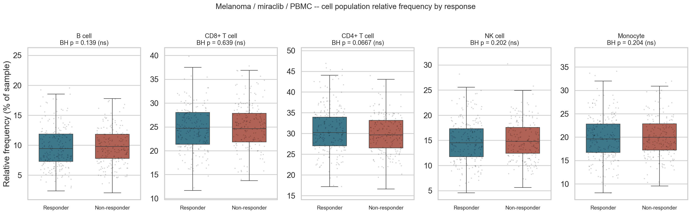
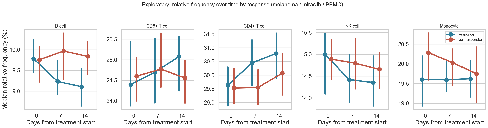

# Loblaw Bio — Cell Count Analysis

A small, reproducible pipeline that loads immune-cell-count data for a set of clinical
trials into a relational database, computes per-sample population frequencies, tests
whether those frequencies separate responders from non-responders, and serves the whole
thing through an interactive dashboard.

```
make setup        # create .venv and install dependencies
make pipeline     # build the database, run parts 2–4, write outputs/
make dashboard    # launch the interactive dashboard
```

- **Live dashboard:** https://teiko-cell-count-analysis-mcw8kqnedmmxy9qczl9xyx.streamlit.app
- **Repository:** https://github.com/JC01111/teiko-cell-count-analysis

---

## Contents

| Path | What it is |
|---|---|
| `load_data.py` | **Part 1.** Creates the SQLite database and loads `cell-count.csv`. |
| `db/schema.sql` | The schema, with the design rationale in comments. |
| `analysis/frequencies.py` | **Part 2.** Relative frequency of each population per sample. |
| `analysis/statistics_report.py` | **Part 3.** Responder vs non-responder comparison + boxplots. |
| `analysis/subsets.py` | **Part 4.** Baseline subset breakdowns. |
| `analysis/run_all.py` | Runs parts 2–4 end to end (`make pipeline`). |
| `dashboard/app.py` | Streamlit dashboard covering every part interactively. |
| `data/cell-count.csv` | The input data. |
| `outputs/` | Generated tables (`*.csv`) and figures (`figures/*.png`). |
| `tests/` | pytest suite (`make test`). |

Requires Python ≥ 3.9. Everything else is installed by `make setup`.

---

## Part 1 — Database design

### Why a database at all

The CSV is one wide, fully denormalised row per sample. That is fine at 10,500 rows and
five markers, and it stops being fine the moment you have hundreds of projects, a panel
that grows past a handful of populations, or a subject who appears in more than one
study. The schema below is built for the second case.

```
project ─┐
         ├──< enrollment >── subject
condition┤        │
treatment┘        │
                  └──< sample >──< sample_cell_count >── cell_population
                          │
                     sample_type
```

| Table | Grain | Notes |
|---|---|---|
| `project` | one study | `prj1`, `prj2`, … |
| `subject` | one person | only truly person-level attributes (`sex`) |
| `enrollment` | one subject × project × treatment arm | carries `condition`, `response`, `age_at_enrollment` |
| `sample` | one specimen | `sample_type`, `time_from_treatment_start` |
| `sample_cell_count` | one **(sample, population)** measurement | the fact table |
| `condition` / `treatment` / `sample_type` / `cell_population` | controlled vocabularies | new values are rows, not code changes |

### The three decisions that matter

**1. Cell counts are rows, not columns.** `sample_cell_count(sample_id, population_id,
cell_count)` is the single most important choice here. Adding dendritic cells or a
20-colour panel is an `INSERT` into `cell_population` — no `ALTER TABLE`, no schema
migration, no rewrite of downstream queries, and no sparse NULL columns for markers that
a given panel did not measure. `load_data.py` is written to match: any CSV column that is
not a known clinical attribute is *automatically* registered as a cell population, so a
wider CSV loads with zero code changes (there is a test for exactly this).

**2. `enrollment` sits between subject and sample.** Condition, treatment, response and
age are properties of a subject *in a particular study*, not of the person forever. Split
this way, a subject who later joins a second trial — or the same subject on a different
treatment arm — is a new `enrollment` row, not a duplicated person or a contradiction.
It also means "how many subjects" and "how many samples" are both one honest `COUNT`.

**3. Frequency is defined once, in SQL.** `v_sample_frequency` computes
`100 × count / total_count`; `v_analysis_base` joins every clinical attribute onto every
measurement. The Python analysis, the tests and the dashboard all read those views, so
they cannot drift apart on the definition of a percentage.

Scaling notes: the fact table is `WITHOUT ROWID` with a `(sample_id, population_id)`
primary key, and there are covering indexes on the filters the analytics actually use
(condition/treatment/response, sample type + timepoint). At hundreds of projects and
thousands of samples this schema ports to Postgres unchanged — the only things to add
are partitioning on `sample_cell_count` and a nightly rollup of `v_sample_frequency`
into a materialised view. Adding a second assay type (e.g. cytokine panels) means one
more fact table beside `sample_cell_count`, not a redesign.

### Loading

```bash
python load_data.py                        # data/cell-count.csv → db/cell_counts.db
python load_data.py --csv other.csv --db /tmp/other.db
python load_data.py --append               # upsert into an existing database
```

The loader is idempotent (`ON CONFLICT … DO UPDATE` on both `sample` and
`sample_cell_count`), validates that required columns are present, and treats empty
strings / `NA` as SQL `NULL` — with the deliberate exception of `none`, which is a real
treatment value in this dataset, not a missing one.

**Result:** 10,500 samples · 3,500 subjects · 3 projects · 5 populations · 52,500 count rows.

---

## Part 2 — Relative frequencies

`make pipeline` writes `outputs/cell_frequencies.csv` with exactly the requested columns:

| sample | total_count | population | count | percentage |
|---|---|---|---|---|
| sample00000 | 93214 | b_cell | 10908 | 11.7021 |
| sample00000 | 93214 | cd4_t_cell | 20491 | 21.9827 |
| sample00000 | 93214 | cd8_t_cell | 24440 | 26.2192 |
| sample00000 | 93214 | monocyte | 23511 | 25.2226 |
| sample00000 | 93214 | nk_cell | 13864 | 14.8733 |

52,500 rows (10,500 samples × 5 populations). `total_count` is the sum of all populations
measured on that sample; percentages sum to 100 per sample (verified to within rounding
in the pipeline output and in `tests/`).

---

## Part 3 — Responders vs non-responders

**Cohort:** melanoma · miraclib · PBMC → **1,968 samples from 656 subjects**
(993 responder / 975 non-responder samples).

**Method.** For each population we compare the *relative frequency* between the two
groups with a two-sided **Mann-Whitney U** test — relative frequencies are bounded and
mildly skewed, so a rank test avoids a normality assumption that buys us nothing. Welch's
t-test is reported alongside as a sanity check and agrees throughout. Five populations
are tested, so p-values are adjusted with **Benjamini-Hochberg FDR**. Effect size is
reported as the rank-biserial correlation and the raw difference in medians, because at
n ≈ 2,000 a statistically significant difference can still be biologically trivial.

**Repeated measures.** Every subject contributes up to three timepoints, so the samples
are not independent. The headline analysis uses all samples as the brief specifies, and a
**subject-level sensitivity analysis** (one mean per subject, n = 656) is run alongside.
The two agree, which is the point of running both.

### Result

| Population | Median (responder) | Median (non-responder) | Δ (pp) | Mann-Whitney p | BH-adjusted p | Significant |
|---|---|---|---|---|---|---|
| CD4+ T cell | 30.22 % | 29.66 % | **+0.56** | 0.0133 | 0.067 | no |
| B cell | 9.43 % | 9.79 % | −0.36 | 0.0557 | 0.139 | no |
| NK cell | 14.51 % | 14.80 % | −0.29 | 0.121 | 0.202 | no |
| Monocyte | 19.61 % | 19.94 % | −0.33 | 0.163 | 0.204 | no |
| CD8+ T cell | 24.73 % | 24.60 % | +0.12 | 0.639 | 0.639 | no |

**No cell population differs significantly between responders and non-responders after
correcting for multiple testing.** CD4+ T cells come closest (raw p = 0.013, BH p = 0.067,
higher in responders) and the subject-level analysis puts it in the same place
(raw p = 0.012, BH p = 0.062). Reported honestly: this is a trend, not a hit.



### What the data does suggest

Splitting the same comparison by timepoint (exploratory, hypothesis-generating only —
FDR applied within each timepoint) shows the groups **separating over time on treatment**
rather than differing at baseline:

| Population | Day 0 (R vs NR) | Day 7 | Day 14 |
|---|---|---|---|
| CD4+ T cell | 29.63 vs 29.53 (p = 0.80) | 30.45 vs 29.55 (p = 0.030) | 30.79 vs 30.07 (p = 0.075) |
| B cell | 9.79 vs 9.76 (p = 0.55) | 9.23 vs 9.97 (p = 0.14) | 9.11 vs 9.84 (p = 0.014) |



At baseline the two groups are indistinguishable on every marker. By day 14, responders
have drifted toward **higher CD4+ T cell** and **lower B cell** fractions. Neither
individual test survives correction, but the direction is consistent across timepoints
and across two populations, which is exactly the shape you would chase with a
longitudinal mixed-effects model (`frequency ~ response × time + (1|subject)`) on a
larger cohort — the analysis this dataset is not powered for, but is set up for.

Outputs: `outputs/part3_response_statistics.csv`,
`part3_response_statistics_subject_level.csv`, `part3_response_statistics_by_timepoint.csv`,
`part3_cohort_frequencies.csv`.

---

## Part 4 — Baseline subset

**Subset:** melanoma · miraclib · **PBMC** · `time_from_treatment_start = 0`
→ **656 samples from 656 subjects** (one baseline draw each).

**(a) Samples per project**

| project | samples | subjects |
|---|---|---|
| prj1 | 384 | 384 |
| prj3 | 272 | 272 |

`prj2` contributes nothing to this subset — it has no melanoma / miraclib / PBMC arm.

**(b) Responders vs non-responders**

| response | samples |
|---|---|
| yes | 331 |
| no | 325 |

**(c) Males vs females**

| sex | samples |
|---|---|
| M | 344 |
| F | 312 |

**Average B cells — melanoma males, responders, time = 0, all sample types and treatments**

**10,206.15 B cells** (n = 485 samples from 485 subjects; range 3,449 – 23,812).

Note the deliberately wider filter on this last question: it drops the PBMC and miraclib
restrictions and keeps only *melanoma · male · responder · day 0*, as asked.

Outputs: `outputs/part4_*.csv`. Every one of these answers is a `WHERE` clause against
the schema — see `analysis/subsets.py`, where the SQL is written out in full.

---

## Dashboard

```bash
make dashboard      # http://localhost:8501
```

Five tabs:

* **Overview** — cohort size, population composition, distribution of frequencies, make-up by condition / treatment / sample type / response.
* **Part 2 · Frequencies** — the full frequency table, downloadable as CSV, plus stacked per-sample composition.
* **Part 3 · Responders** — grouped boxplots, the live statistics table (with a toggle to collapse to one value per subject), and the time course.
* **Part 4 · Baseline subset** — the three breakdowns and the B-cell metric, with its own independent filter controls.
* **Schema** — the diagram and the full DDL.

The sidebar filters (condition, treatment, sample type, project, sex, timepoint) drive
the first three tabs, so the Part 3 analysis is not hard-coded to melanoma/miraclib/PBMC —
point it at carcinoma + phauximab and the same tests re-run. A **Reset to the Part 3
cohort** button restores the assignment's cohort.

If `db/cell_counts.db` is missing the dashboard builds it from `data/cell-count.csv` on
first launch, so a fresh clone or a cloud deployment works with no extra steps.

### Hosted version

https://teiko-cell-count-analysis-mcw8kqnedmmxy9qczl9xyx.streamlit.app

Deployed on Streamlit Community Cloud straight from this repository —
`dashboard/app.py` as the entrypoint, `requirements.txt` for dependencies. No secrets and
no external services: the database is rebuilt from the committed CSV on first boot, which
is why the deployment needs no build step. `make dashboard` runs the identical app
locally on <http://localhost:8501>.

---

## Tests

```bash
make test
```

Eight tests covering the loader (row counts, `NULL` vs the literal `none` treatment,
idempotent re-load, automatic pickup of a **new population column** with no schema
change), the frequency view (percentages sum to 100, known values are exact), the BH
correction (monotonic, never below the raw p-value), and the Part 3 / Part 4 cohort
filters.

---

## Assumptions and caveats

* `response` is empty for all 1,422 healthy-donor rows; those are loaded as `NULL` and
  excluded from every responder comparison rather than being treated as non-responders.
* Subject-level attributes were verified constant across each subject's samples before
  normalising them onto `enrollment` (0 of 3,500 subjects had conflicting values).
* Relative frequencies are computed against the sum of the five measured populations,
  not against a separately reported total cell count — the CSV provides no such column.
* The Part 3 result is a null result. With three correlated samples per subject and a
  ~0.5 pp effect, this cohort is not powered to detect the CD4+ trend it hints at; the
  time-course split is exploratory and is labelled as such everywhere it appears.
